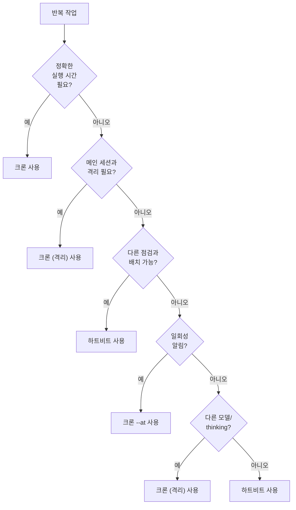

# 크론 vs 하트비트

반복 작업을 자동화할 때 **하트비트**와 **크론 작업** 중 어떤 것을 사용할지 가이드합니다.

## 빠른 결정 가이드

| 사용 사례                   | 권장          | 이유                                |
| --------------------------- | ------------- | ----------------------------------- |
| 30분마다 받은편지함 확인    | **하트비트**  | 다른 점검과 함께 배치 처리          |
| 매일 오전 9시 리포트 전송   | **크론 (격리)** | 정확한 타이밍 필요                 |
| 캘린더 모니터링             | **하트비트**  | 주기적 인식에 자연스러운 적합       |
| 주간 심층 분석 실행         | **크론 (격리)** | 독립 작업, 다른 모델 사용 가능     |
| 20분 후 알림                | **크론 (메인, `--at`)** | 일회성, 정확한 타이밍        |
| 백그라운드 프로젝트 상태 점검| **하트비트**  | 기존 사이클에 편승                  |

## 하트비트: 주기적 인식

하트비트는 에이전트가 **주기적으로 깨어나** HEARTBEAT.md의 지침을 수행합니다.

### 특성

- 메인 세션 안에서 실행 (전체 히스토리 접근)
- 일정 간격으로 자동 트리거
- 여러 점검 항목을 한 번에 배치 처리
- 정확한 시간 보장 없음 (대략적인 간격)

### 설정

```json5
{
  agents: {
    defaults: {
      heartbeat: {
        every: "30m",
        target: "last",
        activeHours: { start: "08:00", end: "22:00" },
      },
    },
  },
}
```

### 적합한 경우

- 여러 점검을 배치로 수행할 때
- 메인 세션 컨텍스트가 필요할 때
- 정확한 실행 시간이 중요하지 않을 때
- 별도 세션/모델이 필요 없을 때

## 크론: 정밀 스케줄링

크론 작업은 **정확한 시간**에 실행되며, 격리된 세션이나 메인 세션에서 동작합니다.

### 특성

- 정확한 시간에 트리거 (cron 표현식 / `--at` 단일 지연)
- 격리 세션: 매 실행마다 깨끗한 상태
- 메인 세션: 시스템 이벤트로 주입
- 모델, thinking 레벨 오버라이드 가능

### 크론 작업 추가 예시

**반복 작업 (격리 세션):**

```bash
openclaw cron add \
  --name "Morning briefing" \
  --cron "0 7 * * *" \
  --tz "Asia/Seoul" \
  --session isolated \
  --message "오늘의 브리핑을 생성하세요..." \
  --model opus \
  --announce \
  --channel whatsapp \
  --to "+821012345678"
```

**일회성 알림 (메인 세션):**

```bash
openclaw cron add \
  --name "Meeting reminder" \
  --at "20m" \
  --session main \
  --system-event "알림: 스탠드업 미팅이 10분 후 시작됩니다." \
  --wake now \
  --delete-after-run
```

### 적합한 경우

- 정확한 실행 시간이 필요할 때
- 메인 세션과 격리가 필요할 때
- 다른 모델이나 thinking 레벨을 사용하고 싶을 때
- 실행 결과를 특정 채널로 전달하고 싶을 때

## 결정 플로우차트



## 두 가지 조합

하트비트와 크론을 함께 사용할 수 있습니다:

```json5
{
  agents: {
    defaults: {
      heartbeat: {
        every: "30m",             // 기본 모니터링
      },
    },
  },
}
```

```bash
# 매일 오전 9시 별도 리포트
openclaw cron add \
  --name "Daily report" \
  --cron "0 9 * * *" \
  --session isolated \
  --model sonnet \
  --message "어제 활동 요약 리포트를 작성하세요"
```

## 세션 비교

|                | 하트비트         | 크론 (메인)              | 크론 (격리)            |
| -------------- | ---------------- | ------------------------ | ---------------------- |
| **세션**       | 메인             | 메인 (시스템 이벤트)     | `cron:<jobId>`         |
| **히스토리**   | 공유             | 공유                     | 매 실행마다 초기화     |
| **컨텍스트**   | 전체             | 전체                     | 없음 (깨끗한 시작)    |
| **모델**       | 메인 세션 모델   | 메인 세션 모델           | 오버라이드 가능        |
| **출력**       | HEARTBEAT_OK 아닐 때 | 하트비트 프롬프트 + 이벤트 | announce 요약       |

## 비용 고려사항

| 방식             | 비용 특성                                    |
| ---------------- | -------------------------------------------- |
| **하트비트**     | N분마다 1턴; HEARTBEAT.md 크기에 비례        |
| **크론 (메인)**  | 다음 하트비트에 이벤트 추가 (별도 턴 없음)   |
| **크론 (격리)**  | 작업당 전체 에이전트 턴; 저렴한 모델 사용 가능 |

### 비용 최적화 팁

- 하트비트의 HEARTBEAT.md를 간결하게 유지
- 비용이 중요한 격리 크론은 저렴한 모델 사용 (`--model haiku`)
- 메인 세션 크론은 별도 비용이 거의 없음

## 다음 단계

- [하트비트](/ko-KR/gateway/heartbeat) - 하트비트 상세 설정
- [자동화](/ko-KR/automation) - 크론 작업 관리
- [훅](/ko-KR/automation/hooks) - 이벤트 기반 자동화
