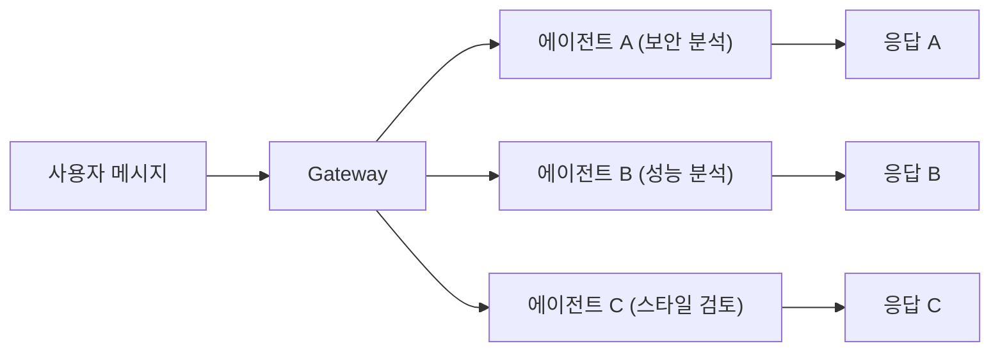

# 브로드캐스트 그룹

> **실험적 기능** — WhatsApp (web 채널)에서만 지원됩니다.

브로드캐스트 그룹은 하나의 인바운드 메시지를 여러 에이전트가 동시에 처리하는 기능입니다.

## 동작 방식



각 에이전트는 독립적인 세션에서 실행되며, 각각의 응답이 채팅에 전송됩니다.

## 설정

### 기본 구조

```json5
{
  broadcast: {
    "120363403215116621@g.us": ["alfred", "baerbel", "assistant3"],
  },
}
```

- 키: WhatsApp 그룹 JID (peer ID)
- 값: 에이전트 ID 배열

### 에이전트 정의

```json5
{
  agents: {
    list: [
      {
        id: "alfred",
        model: "anthropic/claude-opus-4-6",
        workspace: "~/.openclaw/workspaces/security",
      },
      {
        id: "baerbel",
        model: "anthropic/claude-sonnet-4-20250514",
        workspace: "~/.openclaw/workspaces/performance",
      },
      {
        id: "assistant3",
        model: "openai/gpt-4.1",
        workspace: "~/.openclaw/workspaces/style",
      },
    ],
  },
  broadcast: {
    "120363403215116621@g.us": ["alfred", "baerbel", "assistant3"],
  },
}
```

## 처리 전략

| 전략           | 설명                       |
| -------------- | -------------------------- |
| `parallel`     | 모든 에이전트 동시 실행 (기본) |
| `sequential`   | 순서대로 실행              |

## 세션 격리

각 에이전트는 완전히 격리된 세션을 가집니다:

- **세션 키**: 에이전트별 별도 세션 (`agent:alfred:whatsapp:group:...`)
- **히스토리**: 독립적인 대화 히스토리
- **워크스페이스**: 에이전트별 워크스페이스
- **도구 접근**: 에이전트별 도구 설정
- **메모리**: 독립적인 메모리

## 그룹 컨텍스트

모든 브로드캐스트 에이전트는 동일한 그룹 컨텍스트를 공유합니다:

```
[Chat messages since your last reply - for context]
홍길동: 이 코드를 리뷰해주세요
[End of context]
```

## 라우팅 우선순위

`broadcast` 설정은 `bindings`보다 우선합니다:

1. **broadcast** — 매칭되면 모든 에이전트에 전달 (최고 우선순위)
2. **bindings** — 단일 에이전트 라우팅
3. **기본** — `main` 에이전트

## 사용 사례

### 코드 리뷰 팀

```json5
{
  broadcast: {
    "code-review-group@g.us": ["security-bot", "perf-bot", "style-bot"],
  },
}
```

### 다국어 지원

```json5
{
  broadcast: {
    "multilang-group@g.us": ["en-agent", "ko-agent", "ja-agent"],
  },
}
```

### QA 워크플로우

```json5
{
  broadcast: {
    "qa-group@g.us": ["test-agent", "doc-agent"],
  },
}
```

## 베스트 프랙티스

- 각 에이전트의 역할을 명확히 정의하세요 (`AGENTS.md`에서)
- 다른 도구 접근 권한을 설정하세요
- 성능을 모니터링하세요 (동시 에이전트가 많으면 리소스 소비 증가)
- 실패를 처리하세요 — 한 에이전트 실패가 다른 에이전트에 영향 없음

## 문제 해결

| 증상                    | 해결                                    |
| ----------------------- | --------------------------------------- |
| 에이전트가 응답하지 않음 | 에이전트 ID가 `agents.list`에 있는지 확인 |
| 일부만 응답             | 각 에이전트의 인증 프로필 확인          |
| 중복 응답               | peer ID 형식 (JID) 확인                 |

## 다음 단계

- [채널 라우팅](/ko-KR/channels/channel-routing) - 일반 라우팅 규칙
- [멀티 에이전트](/ko-KR/concepts/multi-agent) - 멀티 에이전트 설정
- [에이전트 설정](/ko-KR/concepts/agent) - 에이전트 커스터마이징
