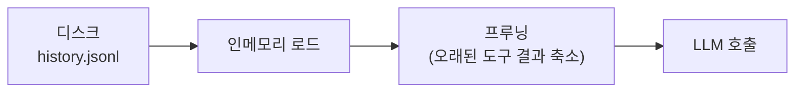

# 세션 프루닝

세션 프루닝은 LLM 호출 전에 오래된 도구 결과를 인메모리에서 트리밍합니다. **디스크의 세션 히스토리는 변경하지 않습니다.**

## 동작 방식



1. 세션 JSONL에서 히스토리를 인메모리에 로드
2. 프루닝 정책에 따라 오래된 도구 결과를 축소
3. 축소된 히스토리로 LLM 호출
4. **디스크의 원본 히스토리는 그대로 유지**

## 프루닝 대상

- **프루닝됨**: `toolResult` 메시지의 내용
- **프루닝 안 됨**: `user` 메시지, `assistant` 메시지 (절대 수정하지 않음)

## 보호 규칙

마지막 `keepLastAssistants` (기본: 3)개의 어시스턴트 메시지와 관련된 도구 결과는 보호됩니다.

## 축소 방식

### 소프트 트림

큰 도구 결과의 시작부와 끝부만 유지합니다:

```
[도구 결과 시작 부분]
...
(중간 생략, 전체 12,345자)
...
[도구 결과 끝 부분]
```

### 하드 클리어

전체 결과를 플레이스홀더로 교체합니다:

```
[이전 도구 실행 결과 — 세부 내용은 프루닝됨]
```

## 모드

### cache-ttl

마지막 Anthropic API 호출이 TTL보다 오래되면 프루닝을 트리거합니다.

```json5
{
  agents: {
    defaults: {
      contextPruning: {
        mode: "cache-ttl",
        ttl: "5m",                    // TTL 기간
        tools: {
          allow: ["exec", "read"],    // 프루닝할 도구 (화이트리스트)
          deny: ["*image*"],          // 프루닝 제외할 도구 (블랙리스트)
        },
      },
    },
  },
}
```

## 스마트 기본값

Anthropic 인증 방식에 따라 자동으로 프루닝이 구성됩니다:

| 인증 방식             | contextPruning | 하트비트 | cacheControlTtl |
| --------------------- | -------------- | -------- | --------------- |
| OAuth / setup-token   | cache-ttl 활성 | 1시간    | —               |
| API 키                | cache-ttl 활성 | 30분     | 1시간           |

## 비용 영향

프루닝은 Anthropic의 프롬프트 캐싱과 함께 작동합니다:

1. 오래된 도구 결과 축소 → 입력 토큰 감소
2. 캐시 히트 → 캐시된 토큰 가격 적용
3. 전체적으로 API 비용 절감

## 다음 단계

- [컨텍스트 관리](/ko-KR/concepts/context) - 컨텍스트 최적화
- [세션](/ko-KR/concepts/sessions) - 세션 관리
- [모델 프로바이더](/ko-KR/concepts/model-providers) - 프로바이더별 설정
