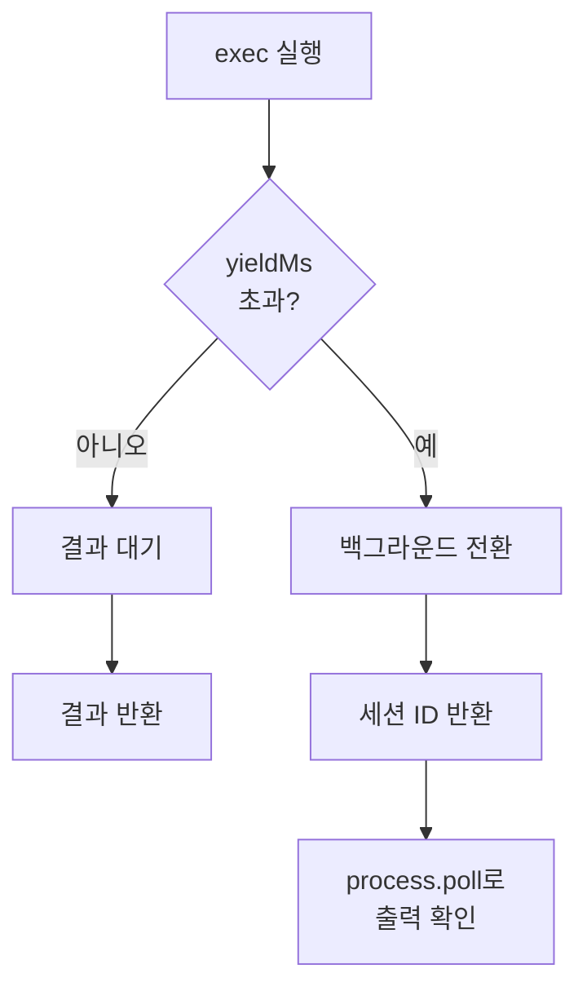

# 백그라운드 Exec과 프로세스 도구

`exec` 도구로 실행한 명령어가 일정 시간을 초과하면 자동으로 백그라운드로 전환됩니다. `process` 도구로 백그라운드 프로세스를 모니터링하고 관리합니다.

## exec 도구 파라미터

| 파라미터     | 타입      | 기본값   | 설명                                      |
| ------------ | --------- | -------- | ----------------------------------------- |
| `command`    | `string`  | (필수)   | 실행할 명령어                             |
| `yieldMs`    | `number`  | `10000`  | 이 시간 후 자동 백그라운드 전환 (ms)      |
| `background` | `boolean` | `false`  | 즉시 백그라운드로 실행                    |
| `timeout`    | `number`  | `1800`   | 이 시간 후 프로세스 종료 (초)             |
| `elevated`   | `boolean` | `false`  | 호스트에서 직접 실행 (허용된 경우)        |
| `pty`        | `boolean` | `false`  | 실제 TTY 할당                             |
| `workdir`    | `string`  | —        | 작업 디렉토리                             |
| `env`        | `object`  | —        | 추가 환경 변수                            |

## 동작 방식



### 자동 백그라운드 전환

1. 에이전트가 `exec` 도구를 호출
2. `yieldMs` (기본 10초) 동안 결과 대기
3. 시간 초과 시 자동으로 백그라운드 세션 생성
4. 세션 ID를 에이전트에 반환
5. 에이전트는 `process` 도구로 상태 확인

### 즉시 백그라운드 실행

```json
{
  "tool": "exec",
  "command": "npm run build",
  "background": true
}
```

## 자식 프로세스 브릿지

백그라운드 프로세스의 stdout/stderr는 브릿지를 통해 수집됩니다:

- 출력은 인메모리 버퍼에 저장
- `process.poll`로 새로운 출력을 가져옴
- `process.log`로 전체 출력을 읽음

## process 도구 액션

| 액션       | 설명                                     | 파라미터                           |
| ---------- | ---------------------------------------- | ---------------------------------- |
| `list`     | 실행 중 + 완료된 세션 목록               | —                                  |
| `poll`     | 새로운 출력 가져오기                     | `sessionId`                        |
| `log`      | 전체 출력 읽기 (offset/limit 지원)       | `sessionId`, `offset?`, `limit?`   |
| `write`    | stdin에 입력 전송                        | `sessionId`, `data`                |
| `kill`     | 실행 중인 세션 종료                      | `sessionId`                        |
| `clear`    | 완료된 세션 제거                         | `sessionId`                        |
| `remove`   | 실행 중이면 kill, 완료되었으면 clear     | `sessionId`                        |

## 사용 예시

### 장시간 빌드

```json
{ "tool": "exec", "command": "npm run build", "background": true }
```

```json
{ "tool": "process", "action": "poll", "sessionId": "<id>" }
```

### 자동 백그라운드 전환

```json
{ "tool": "exec", "command": "sleep 5 && echo done", "yieldMs": 1000 }
```

1초 후 자동으로 백그라운드로 전환되며 세션 ID가 반환됩니다.

### stdin 입력

인터랙티브 프로그램에 입력을 보냅니다:

```json
{ "tool": "process", "action": "write", "sessionId": "<id>", "data": "y\n" }
```

### 출력 확인 (페이지네이션)

```json
{ "tool": "process", "action": "log", "sessionId": "<id>", "offset": 0, "limit": 100 }
```

### 세션 정리

```json
{ "tool": "process", "action": "remove", "sessionId": "<id>" }
```

## 환경 변수와 설정

### 환경 변수

| 변수                                       | 기본값  | 설명                             |
| ------------------------------------------ | ------- | -------------------------------- |
| `PI_BASH_YIELD_MS`                         | `10000` | 자동 백그라운드 전환 시간 (ms)   |
| `PI_BASH_MAX_OUTPUT_CHARS`                 | —       | 인메모리 출력 최대 크기          |
| `OPENCLAW_BASH_PENDING_MAX_OUTPUT_CHARS`   | —       | pending stdout/stderr 최대 크기  |
| `PI_BASH_JOB_TTL_MS`                       | —       | 완료된 세션 TTL (1분~3시간)     |

### 설정 파일

```json5
{
  tools: {
    exec: {
      backgroundMs: 10000,     // 자동 백그라운드 전환 (ms)
      timeoutSec: 1800,        // 최대 실행 시간 (초, 기본 30분)
      cleanupMs: 1800000,      // 완료 세션 정리 시간 (ms)
      notifyOnExit: true,      // 완료 시 에이전트에 알림
    },
  },
}
```

### notifyOnExit

`true` (기본)일 때, 백그라운드 프로세스가 완료되면 에이전트에 시스템 이벤트로 알립니다. 에이전트는 다음 턴에서 결과를 확인할 수 있습니다.

## 보안 고려사항

- `elevated: true`는 샌드박스를 우회하여 호스트에서 직접 실행합니다
- `pty: true`는 TTY가 필요한 인터랙티브 프로그램에 사용합니다
- 장시간 프로세스는 `timeout`으로 제한하세요
- 민감한 명령어는 승인 워크플로우를 통해 실행됩니다

## 다음 단계

- [명령어 실행](/ko-KR/tools/exec) - exec 도구 보안 모드
- [멀티 에이전트 샌드박스](/ko-KR/tools/multi-agent-sandbox-tools) - 도구 접근 제어
- [에이전트 실행 루프](/ko-KR/concepts/agent-loop) - 도구 실행 단계
