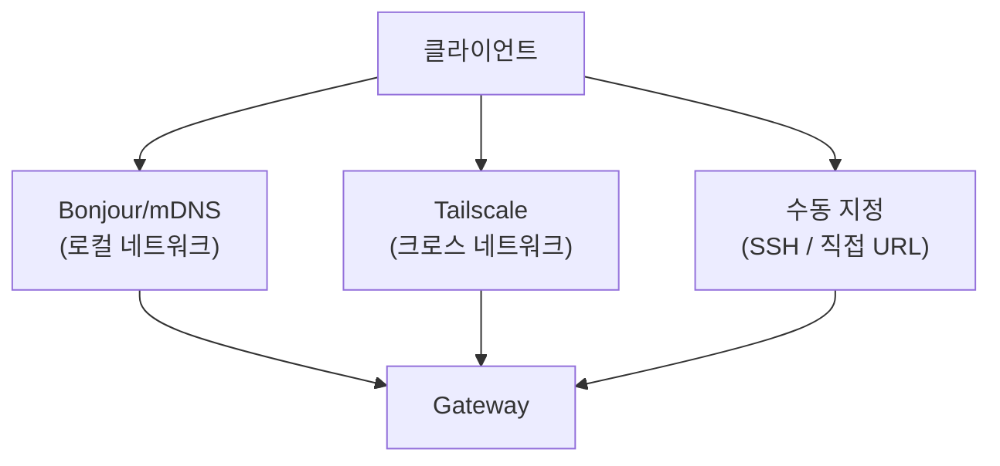
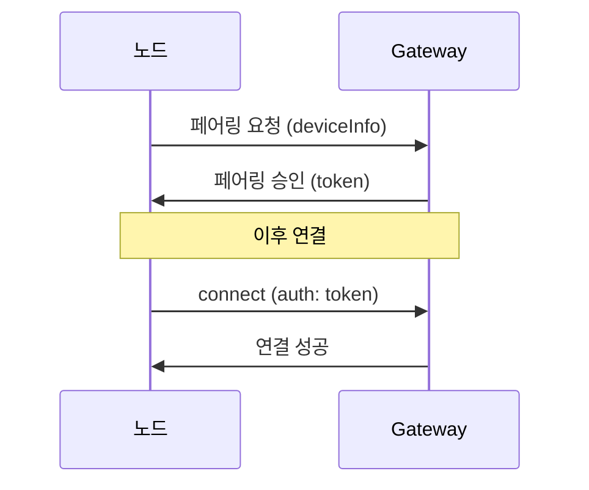

# 디스커버리와 트랜스포트

클라이언트(노드, CLI, 웹 UI)가 Gateway를 찾고 연결하는 방법을 설명합니다.

## 디스커버리 입력

클라이언트는 다음 방법 중 하나로 Gateway를 찾습니다:



## Bonjour / mDNS

Gateway는 로컬 네트워크에 mDNS 서비스를 브로드캐스트합니다.

### 서비스 타입

```
_openclaw-gw._tcp
```

### TXT 레코드

| 키             | 설명                          | 예시                     |
| -------------- | ----------------------------- | ------------------------ |
| `role`         | 서비스 역할                   | `gateway`                |
| `lanHost`      | LAN 호스트 주소               | `192.168.1.100`          |
| `sshPort`      | SSH 포트                      | `22`                     |
| `gatewayPort`  | Gateway WebSocket 포트        | `18789`                  |
| `gatewayTls`   | TLS 활성 여부                 | `true`                   |
| `canvasPort`   | Canvas 서버 포트              | `18790`                  |
| `cliPath`      | CLI 실행 파일 경로            | `/usr/local/bin/openclaw`|
| `tailnetDns`   | Tailscale DNS 이름            | `myhost.tail12345.ts.net`|

### 기본 엔드포인트

```
ws://127.0.0.1:18789
```

### 비활성화

```bash
OPENCLAW_DISABLE_BONJOUR=1 openclaw gateway
```

## Tailscale (크로스 네트워크)

같은 Tailnet에 속한 기기들은 Tailscale DNS를 통해 Gateway를 찾습니다.

```json5
{
  gateway: {
    bind: "tailscale",  // Tailscale 인터페이스에 바인딩
  },
}
```

환경 변수:

```bash
OPENCLAW_TAILNET_DNS=myhost.tail12345.ts.net
```

TXT 레코드의 `tailnetDns` 필드를 통해 노드가 Tailnet 주소를 자동으로 발견합니다.

## 수동 / SSH

Bonjour가 불가능한 환경에서는 직접 지정합니다:

```bash
# SSH를 통한 원격 연결
openclaw --remote ssh://user@host

# 직접 URL 지정
openclaw --remote ws://192.168.1.100:18789
```

환경 변수:

```bash
OPENCLAW_SSH_PORT=22
OPENCLAW_CLI_PATH=/usr/local/bin/openclaw
```

## 트랜스포트 선택

클라이언트는 정책에 따라 트랜스포트를 선택합니다:

| 트랜스포트     | 사용 조건                       | 지연 시간 |
| -------------- | ------------------------------- | --------- |
| **직접 WS**    | 로컬 네트워크, Tailnet          | 최저      |
| **SSH 터널**   | 원격 서버, NAT 뒤              | 중간      |
| **Tailscale**  | 크로스 네트워크 자동 연결       | 중간      |

### 바인드 모드

```json5
{
  gateway: {
    bind: "loopback",    // 127.0.0.1만 (기본)
    // bind: "lan",       // LAN IP에 바인딩
    // bind: "tailscale", // Tailscale 인터페이스
    // bind: "0.0.0.0",   // 모든 인터페이스 (주의)
  },
}
```

## 페어링과 인증

노드가 Gateway에 처음 연결할 때:

1. 노드가 Bonjour 또는 수동으로 Gateway를 발견
2. 페어링 요청 전송 (디바이스 정보 포함)
3. Gateway가 페어링 승인 (토큰 또는 비밀번호)
4. 이후 연결 시 저장된 자격 증명 사용

### 직접 트랜스포트 인증



## 컴포넌트별 역할

| 컴포넌트        | 역할                                        |
| --------------- | ------------------------------------------- |
| **Gateway**     | mDNS 비콘 게시, WS/HTTP 리스닝, 페어링 관리 |
| **CLI**         | mDNS 탐색 또는 수동 URL로 연결              |
| **macOS 앱**    | Bonjour 자동 발견, SSH 폴백                 |
| **iOS/Android** | Bonjour 스캔, Tailnet 발견, 수동 입력       |
| **Control UI**  | 브라우저에서 WS 직접 연결                   |

## 다음 단계

- [Gateway 프로토콜](/ko-KR/gateway/protocol) - WebSocket 프로토콜과 RPC 메서드
- [원격 접근](/ko-KR/gateway/remote) - SSH 터널과 VPN 설정
- [보안](/ko-KR/gateway/security) - 인증과 접근 제어
