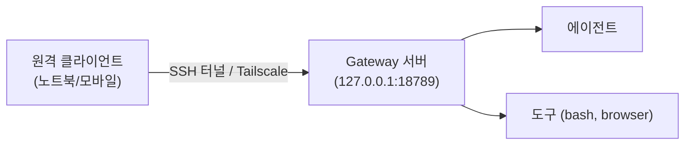

# 원격 접근

Gateway WebSocket은 기본적으로 루프백(`127.0.0.1`)에 바인딩됩니다. 원격에서 접근하려면 SSH 터널, Tailnet, 또는 VPN을 사용합니다.

## 핵심 아이디어



Gateway는 **로컬**에서 에이전트와 도구를 실행하고, 클라이언트는 **원격**에서 채팅과 제어만 수행합니다.

## 일반적인 시나리오

### 1. Tailnet 상시 서버

VPS나 홈 서버에서 Gateway를 항상 실행합니다:

```bash
# 서버에서
openclaw gateway --port 18789
```

```bash
# 원격 클라이언트에서 (같은 Tailnet)
openclaw --remote ws://myserver.tail12345.ts.net:18789
```

### 2. 데스크톱 Gateway + 노트북 제어

집 데스크톱에서 Gateway를 실행하고, 외부에서 노트북으로 접근합니다:

```bash
# 데스크톱에서
openclaw gateway

# 노트북에서 (SSH 터널)
ssh -N -L 18789:127.0.0.1:18789 user@desktop-ip
openclaw --remote ws://127.0.0.1:18789
```

### 3. 노트북 Gateway 외부 노출

노트북에서 Gateway를 실행하되 모바일에서도 접근합니다:

```bash
# 노트북에서
openclaw gateway

# Tailscale Serve로 노출
tailscale serve --bg 18789
```

## 명령어 흐름 (무엇이 어디서 실행되나?)

| 구성 요소           | 실행 위치      | 설명                       |
| ------------------- | -------------- | -------------------------- |
| **Gateway 프로세스** | 서버 (로컬)    | 세션, 라우팅, 에이전트 관리 |
| **에이전트 (Pi)**    | 서버 (로컬)    | LLM 호출, 도구 실행        |
| **bash/exec 도구**   | 서버 (로컬)    | 파일 시스템 접근 포함      |
| **browser 도구**     | 서버 (로컬)    | Chrome 프로필 사용         |
| **CLI 클라이언트**   | 원격 (클라이언트)| 채팅 입출력만              |
| **Control UI**       | 원격 (브라우저) | WebSocket으로 연결         |

## SSH 터널

### 기본 터널 (CLI + 도구)

```bash
ssh -N -L 18789:127.0.0.1:18789 user@server-host
```

### 지속 연결 (autossh)

```bash
autossh -M 0 -N -L 18789:127.0.0.1:18789 user@server-host
```

### SSH 설정 (편의)

`~/.ssh/config`에 추가:

```
Host openclaw-server
    HostName server-ip-or-hostname
    User your-user
    LocalForward 18789 127.0.0.1:18789
```

```bash
ssh -N openclaw-server
```

## CLI 원격 기본값

```json5
{
  gateway: {
    mode: "remote",
    remote: {
      url: "ws://127.0.0.1:18789",
      token: "your-gateway-token",
    },
  },
}
```

환경 변수로도 설정 가능:

```bash
export OPENCLAW_GATEWAY_URL=ws://127.0.0.1:18789
export OPENCLAW_GATEWAY_TOKEN=your-gateway-token
```

## 채팅 UI over SSH

헤드리스 서버에서 TUI를 직접 사용합니다:

```bash
ssh user@server openclaw tui
```

또는 tmux/screen 세션 안에서:

```bash
ssh user@server
tmux new -s openclaw
openclaw tui
```

## macOS 앱: Remote over SSH

macOS 앱에서 원격 서버의 Gateway에 SSH로 연결합니다:

1. 설정 → Remote → SSH 연결 추가
2. 호스트, 사용자, 키 경로 입력
3. 앱이 SSH 터널을 자동으로 관리

## 보안

### 토큰 인증

```json5
{
  gateway: {
    auth: {
      token: "your-secure-token",  // 원격 CLI 호출에 필요
    },
    remote: {
      token: "your-secure-token",
    },
  },
}
```

### TLS 인증서 핀닝

```json5
{
  gateway: {
    remote: {
      tlsFingerprint: "sha256://abc123...",  // 원격 TLS 인증서 핀
    },
  },
}
```

### Tailscale 인증

```json5
{
  gateway: {
    auth: {
      allowTailscale: true,  // Tailscale 아이덴티티 헤더로 인증
    },
  },
}
```

### 보안 권장 사항

| 항목                  | 권장                                         |
| --------------------- | -------------------------------------------- |
| **공개 인터넷 노출**  | ❌ 하지 마세요 — SSH/Tailscale 사용          |
| **localhost 바인딩**   | ✅ 기본값 유지                               |
| **토큰 설정**         | ✅ 원격 접근 시 반드시 설정                  |
| **TLS**               | ✅ 가능하면 활성화                           |
| **Tailscale Serve**   | ✅ 가장 간편한 보안 원격 접근               |

## 다음 단계

- [디스커버리](/ko-KR/gateway/discovery) - 노드 디스커버리 프로토콜
- [보안](/ko-KR/gateway/security) - Gateway 보안 설정
- [대시보드](/ko-KR/web/dashboard) - 웹 UI 접근
- [Tailscale](/ko-KR/gateway/tailscale) - Tailscale 통합
