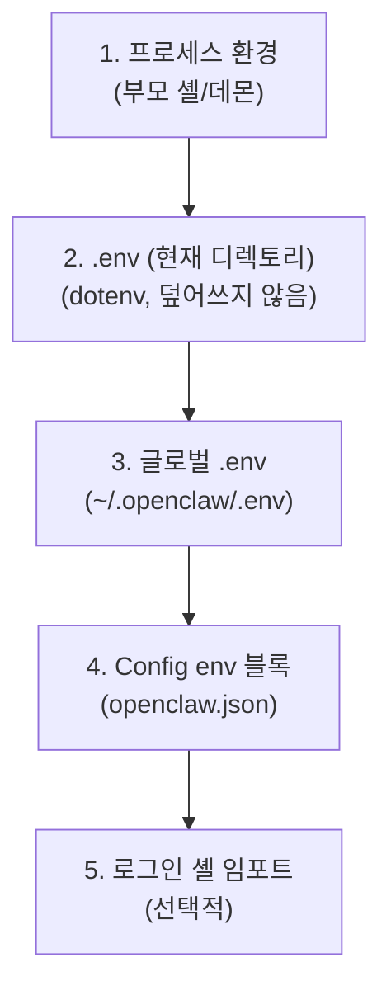

# 환경 변수

OpenClaw가 환경 변수를 로드하는 위치와 우선순위를 설명합니다.

## 우선순위 (높은 것 → 낮은 것)



| 우선순위 | 소스                          | 동작                              |
| -------- | ----------------------------- | --------------------------------- |
| **1**    | 프로세스 환경 (부모 셸/데몬)  | 항상 최우선                       |
| **2**    | `.env` (현재 작업 디렉토리)   | dotenv 기본; 기존 값 덮어쓰지 않음 |
| **3**    | `~/.openclaw/.env` (글로벌)   | 기존 값 덮어쓰지 않음            |
| **4**    | Config `env` 블록             | 값이 없을 때만 설정              |
| **5**    | 로그인 셸 임포트 (선택)       | `env.shellEnv.enabled` 필요      |

## Config `env` 블록

`~/.openclaw/openclaw.json`에서 직접 환경 변수를 설정합니다:

```json5
{
  env: {
    OPENROUTER_API_KEY: "sk-or-...",
    vars: {
      GROQ_API_KEY: "gsk-...",
    },
  },
}
```

- 최상위 키 (`OPENROUTER_API_KEY`)와 `vars` 내부 키 모두 지원
- 이미 프로세스 환경이나 `.env`에 설정된 값은 덮어쓰지 않음

## 셸 환경 임포트

로그인 셸에서 환경 변수를 가져오는 선택적 기능입니다:

```json5
{
  env: {
    shellEnv: {
      enabled: true,
      timeoutMs: 15000,  // 셸 시작 타임아웃 (기본: 15초)
    },
  },
}
```

### 환경 변수로 활성화

```bash
OPENCLAW_LOAD_SHELL_ENV=1 openclaw gateway
OPENCLAW_SHELL_ENV_TIMEOUT_MS=15000
```

### 동작 방식

1. OpenClaw가 로그인 셸을 시작 (`bash -l` 또는 `zsh -l`)
2. 셸의 환경 변수를 추출
3. 아직 설정되지 않은 변수를 프로세스에 추가
4. `~/.profile`, `~/.bash_profile`, `~/.zshrc` 등에서 export된 변수 포함

### 사용 시기

- 데몬으로 실행할 때 `~/.profile`의 API 키가 필요한 경우
- nvm, pyenv 등 셸 초기화가 필요한 경우

## .env 파일

### 현재 디렉토리 .env

프로젝트별 환경 변수:

```bash
# /path/to/project/.env
ANTHROPIC_API_KEY=sk-ant-...
OPENAI_API_KEY=sk-...
```

### 글로벌 .env

모든 세션에 적용:

```bash
# ~/.openclaw/.env
ANTHROPIC_API_KEY=sk-ant-...
ELEVENLABS_API_KEY=...
DEEPGRAM_API_KEY=...
```

## Config에서 환경 변수 치환

설정 파일에서 `${VAR_NAME}` 구문으로 환경 변수를 참조할 수 있습니다:

```json5
{
  models: {
    providers: {
      "vercel-gateway": {
        apiKey: "${VERCEL_GATEWAY_API_KEY}",
      },
    },
  },
}
```

이 치환은 설정 파일 로딩 시 수행되며, 위의 우선순위에 따라 환경 변수가 해석됩니다.

## 주요 환경 변수 목록

### API 키

| 변수                    | 설명                     |
| ----------------------- | ------------------------ |
| `ANTHROPIC_API_KEY`     | Anthropic API 키         |
| `OPENAI_API_KEY`        | OpenAI API 키            |
| `GOOGLE_API_KEY`        | Google AI API 키         |
| `GROQ_API_KEY`          | Groq API 키              |
| `DEEPGRAM_API_KEY`      | Deepgram API 키          |
| `ELEVENLABS_API_KEY`    | ElevenLabs API 키        |
| `OPENROUTER_API_KEY`    | OpenRouter API 키        |

### OpenClaw 설정

| 변수                          | 설명                          |
| ----------------------------- | ----------------------------- |
| `OPENCLAW_PROFILE`            | 프로필 이름 (워크스페이스 분리) |
| `OPENCLAW_DISABLE_BONJOUR`    | Bonjour 비활성화              |
| `OPENCLAW_SSH_PORT`           | SSH 포트                      |
| `OPENCLAW_TAILNET_DNS`        | Tailscale DNS                 |
| `OPENCLAW_CLI_PATH`           | CLI 경로                      |
| `OPENCLAW_LOAD_SHELL_ENV`     | 셸 환경 임포트 활성화         |
| `OPENCLAW_GATEWAY_URL`        | Gateway URL (원격)            |
| `OPENCLAW_GATEWAY_TOKEN`      | Gateway 토큰 (원격)          |

### 디버깅

| 변수                    | 설명                          |
| ----------------------- | ----------------------------- |
| `OPENCLAW_DEBUG`        | 디버그 모드 활성화            |
| `OPENCLAW_LOG_LEVEL`    | 로그 레벨 (debug/info/warn)  |
| `OPENCLAW_LIVE_TEST`    | 라이브 테스트 활성화          |

## 문제 해결

### API 키가 인식되지 않음

1. 우선순위 확인: 프로세스 환경 > .env > config
2. `.env` 파일 위치 확인 (현재 디렉토리 또는 `~/.openclaw/`)
3. Config `env` 블록에 설정되었는지 확인
4. `openclaw doctor`로 진단

### 셸 환경 변수가 로드되지 않음

1. `env.shellEnv.enabled: true` 확인
2. `~/.profile`에서 해당 변수가 `export` 되었는지 확인
3. 타임아웃 증가: `shellEnv.timeoutMs: 30000`
4. 셸 로그인 스크립트에 오류가 없는지 확인

## 다음 단계

- [설정 가이드](/ko-KR/gateway/configuration) - 전체 설정 옵션
- [모델 프로바이더](/ko-KR/concepts/model-providers) - 프로바이더별 인증
- [디버깅](/ko-KR/help/debugging) - 환경 변수 디버깅
- [FAQ](/ko-KR/help/faq) - 환경 변수 관련 FAQ
