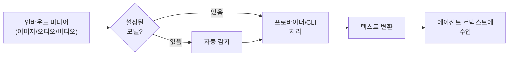

# 미디어 이해

인바운드 이미지, 오디오, 비디오를 에이전트가 이해할 수 있도록 텍스트로 변환합니다. 프로바이더 API 또는 로컬 CLI를 사용합니다.

## 목표

- 채팅으로 받은 미디어를 에이전트가 **이해**할 수 있게 변환
- 이미지 → 설명 텍스트, 오디오 → 트랜스크립트, 비디오 → 장면 설명
- 프로바이더 API와 로컬 CLI를 유연하게 조합

## 동작 방식



## 설정 구조

```json5
{
  tools: {
    media: {
      models: [/* 공유 모델 목록 */],
      image: {/* 이미지 오버라이드 */},
      audio: {/* 오디오 오버라이드 */},
      video: {/* 비디오 오버라이드 */},
    },
  },
}
```

## 모델 엔트리

### 프로바이더 모델

```json5
{
  type: "provider",        // 또는 생략 (기본)
  provider: "openai",
  model: "gpt-5.2",
  prompt: "이 이미지를 설명하세요",
  maxChars: 500,
  maxBytes: 10485760,      // 10MB
  timeoutSeconds: 30,
  capabilities: ["image", "audio"],
  profile: "openai:default",
}
```

### CLI 모델

로컬 도구로 처리합니다:

```json5
{
  type: "cli",
  command: "whisper",
  args: ["--model", "large-v3", "--output-format", "txt", "{{MediaPath}}"],
  maxChars: 0,             // 무제한
  maxBytes: 20971520,      // 20MB
  timeoutSeconds: 120,
  capabilities: ["audio"],
}
```

### CLI 템플릿 변수

| 변수              | 설명                     |
| ----------------- | ------------------------ |
| `{{MediaPath}}`   | 입력 미디어 파일 경로    |
| `{{MediaDir}}`    | 입력 파일 디렉토리       |
| `{{OutputDir}}`   | 출력 디렉토리            |
| `{{OutputBase}}`  | 확장자 없는 출력 파일명  |
| `{{MaxChars}}`    | maxChars 값              |

## 기본값과 제한

| 미디어 타입 | maxChars 기본 | maxBytes 기본 |
| ----------- | ------------- | ------------- |
| **이미지**  | 500           | 10 MB         |
| **오디오**  | 제한 없음     | 20 MB         |
| **비디오**  | 500           | 50 MB         |

## 자동 감지

모델이 설정되지 않으면 자동으로 사용 가능한 프로바이더를 감지합니다:

### 자동 감지 순서

**오디오:**
1. 로컬 CLI: `sherpa-onnx-offline`, `whisper-cli`, `whisper`
2. Gemini CLI
3. 프로바이더 키: OpenAI → Groq → Deepgram → Google

**이미지:**
1. 로컬 CLI (해당 시)
2. Gemini CLI
3. 프로바이더 키: OpenAI → Anthropic → Google → MiniMax

**비디오:**
1. Google (Gemini API)

## 프로바이더 지원 매트릭스

| 프로바이더     | 이미지 | 오디오 | 비디오 |
| -------------- | ------ | ------ | ------ |
| **OpenAI**     | ✅     | ✅     | —      |
| **Anthropic**  | ✅     | —      | —      |
| **Google**     | ✅     | ✅     | ✅     |
| **Groq**       | —      | ✅     | —      |
| **Deepgram**   | —      | ✅     | —      |
| **MiniMax**    | ✅     | —      | —      |

## 권장 프로바이더

### 이미지

```json5
// 높은 품질
{ provider: "openai", model: "gpt-5.2" }
{ provider: "anthropic", model: "claude-opus-4-6" }

// 빠른 처리
{ provider: "google", model: "gemini-3-flash-preview" }
```

### 오디오

```json5
// 정확한 트랜스크립션
{ provider: "openai", model: "gpt-4o-mini-transcribe" }
{ provider: "groq", model: "whisper-large-v3-turbo" }

// 실시간 스트리밍
{ provider: "deepgram", model: "nova-3" }
```

### 비디오

```json5
// 유일한 옵션 (현재)
{ provider: "google", model: "gemini-3-flash-preview" }
{ provider: "google", model: "gemini-3-pro-preview" }
```

## 첨부 정책

미디어 파일이 `maxBytes`를 초과하면 건너뜁니다. 상태 출력 예시:

```
📎 Media: image ok (openai/gpt-5.2) · audio skipped (maxBytes)
```

## 설정 예시

### 이미지 + 오디오 통합 설정

```json5
{
  tools: {
    media: {
      image: {
        models: [
          { provider: "openai", model: "gpt-5.2", maxChars: 500 },
        ],
      },
      audio: {
        models: [
          { provider: "groq", model: "whisper-large-v3-turbo" },
        ],
      },
    },
  },
}
```

### 로컬 Whisper + 프로바이더 폴백

```json5
{
  tools: {
    media: {
      audio: {
        models: [
          {
            type: "cli",
            command: "whisper-cli",
            args: ["--model", "ggml-large-v3.bin", "-f", "{{MediaPath}}"],
            capabilities: ["audio"],
          },
          {
            provider: "openai",
            model: "gpt-4o-mini-transcribe",
            capabilities: ["audio"],
          },
        ],
      },
    },
  },
}
```

## 상태 확인

```bash
openclaw status --deep
```

미디어 이해 상태가 각 타입별로 표시됩니다.

## 다음 단계

- [노드 및 미디어](/ko-KR/nodes) - 미디어 노드 개요
- [설정 가이드](/ko-KR/gateway/configuration) - 상세 설정 옵션
- [모델 프로바이더](/ko-KR/concepts/model-providers) - AI 모델 설정
