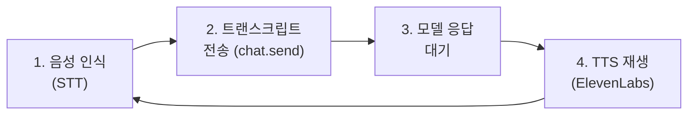

# Talk 모드

Talk 모드는 음성 인식과 ElevenLabs TTS를 결합하여 에이전트와 연속적인 음성 대화를 가능하게 합니다.

## 동작 방식



1. **듣기**: 마이크에서 음성을 인식
2. **전송**: 트랜스크립트를 메인 세션의 `chat.send`로 전송
3. **대기**: 모델의 응답을 기다림
4. **말하기**: ElevenLabs를 통해 스트리밍 TTS 재생

대화가 끝나면 다시 듣기 상태로 돌아갑니다.

## 설정

```json5
{
  talk: {
    voiceId: "elevenlabs_voice_id",
    modelId: "eleven_v3",
    outputFormat: "mp3_44100_128",
    apiKey: "elevenlabs_api_key",
    interruptOnSpeech: true,
  },
}
```

### 설정 항목

| 항목                | 기본값                          | 설명                           |
| ------------------- | ------------------------------- | ------------------------------ |
| `voiceId`           | 환경 변수에서                   | ElevenLabs 음성 ID             |
| `modelId`           | `eleven_v3`                     | TTS 모델                       |
| `outputFormat`      | `pcm_44100` (macOS/iOS)        | 오디오 출력 형식               |
| `apiKey`            | 환경 변수에서                   | ElevenLabs API 키              |
| `interruptOnSpeech` | `true`                          | 말하는 중 새 음성 감지 시 중단 |

### 환경 변수 폴백

| 설정       | 환경 변수                                    |
| ---------- | -------------------------------------------- |
| `voiceId`  | `ELEVENLABS_VOICE_ID` 또는 `SAG_VOICE_ID`   |
| `apiKey`   | `ELEVENLABS_API_KEY`                         |

### 플랫폼별 기본 출력 형식

| 플랫폼      | 기본 출력 형식    |
| ----------- | ----------------- |
| **macOS**   | `pcm_44100`       |
| **iOS**     | `pcm_44100`       |
| **Android** | `pcm_24000`       |

## 음성 디렉티브

에이전트가 응답의 첫 줄에 JSON 디렉티브를 포함하여 음성 설정을 동적으로 변경할 수 있습니다:

```json
{ "voice": "voice-id-here", "once": true }
```

### 지원 키

| 키               | 설명                           |
| ---------------- | ------------------------------ |
| `voice`          | ElevenLabs 음성 ID             |
| `model`          | TTS 모델 ID                   |
| `speed`          | 재생 속도                      |
| `rate`           | 분당 단어 수 (WPM)            |
| `stability`      | 음성 안정성 (0~1)             |
| `similarity`     | 원본 유사도 (0~1)             |
| `style`          | 스타일 강도 (0~1)             |
| `speakerBoost`   | 스피커 부스트                  |
| `seed`           | 랜덤 시드                      |
| `normalize`      | 볼륨 정규화                    |
| `lang`           | 언어 코드                      |
| `output_format`  | 출력 형식                      |
| `latency_tier`   | 지연 시간 티어                 |
| `once`           | `true`이면 이번 응답에만 적용  |

### 음성 디렉티브 예시

```json
{ "voice": "rachel", "stability": 0.8, "similarity": 0.7 }
```

에이전트 AGENTS.md에서 지시할 수 있습니다:

```markdown
## 음성 응답 규칙
한국어로 응답할 때는 첫 줄에 다음을 포함하세요:
{ "voice": "korean-voice-id", "lang": "ko" }
```

## macOS UI

### 활성화

- 메뉴 바에서 **Talk** 토글
- 또는 설정 → **Talk Mode** 그룹

### 오버레이 상태

| 상태        | 표시      | 설명                     |
| ----------- | --------- | ------------------------ |
| **Listening**  | 🎙️ 파란색 | 음성 입력 대기 중        |
| **Thinking**   | 🧠 노란색 | 모델 응답 처리 중        |
| **Speaking**   | 🔊 초록색 | TTS 재생 중              |

### 중단 (Interrupt)

`interruptOnSpeech: true` (기본)일 때:

1. 에이전트가 말하는 중에 사용자가 다시 말하면
2. TTS 재생을 즉시 중단
3. 새 입력으로 전환

## ElevenLabs 설정 팁

### 음성 선택

1. [ElevenLabs Voice Library](https://elevenlabs.io/voice-library)에서 음성 탐색
2. 원하는 음성의 ID를 복사
3. `talk.voiceId`에 설정

### 모델 선택

| 모델              | 특성                      |
| ----------------- | ------------------------- |
| `eleven_v3`       | 최신, 고품질 (기본)       |
| `eleven_turbo_v2` | 빠른 응답, 약간 낮은 품질 |
| `eleven_v2`       | 안정적, 레거시            |

### 비용 최적화

- Talk 모드는 TTS API 호출이 빈번합니다
- 짧은 응답을 유도하면 비용을 절감할 수 있습니다
- AGENTS.md에 "음성 대화 시 간결하게 응답" 지침을 추가하세요

## 문제 해결

| 증상                    | 해결                                    |
| ----------------------- | --------------------------------------- |
| 음성이 재생되지 않음    | ElevenLabs API 키와 음성 ID 확인       |
| 인식이 잘 안 됨         | 마이크 권한 확인, 조용한 환경 확인      |
| 지연 시간이 김          | `eleven_turbo_v2` 모델 사용 고려       |
| 중단이 작동하지 않음    | `interruptOnSpeech: true` 확인         |

## 다음 단계

- [음성 웨이크](/ko-KR/nodes/voicewake) - 웨이크 워드 설정
- [미디어 이해](/ko-KR/nodes/media-understanding) - 오디오 트랜스크립션
- [노드 및 미디어](/ko-KR/nodes) - 노드 개요
