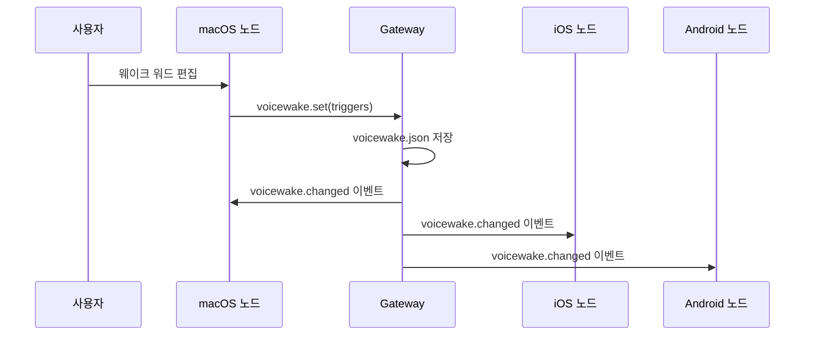

# 음성 웨이크

음성 웨이크 워드는 Gateway에서 중앙 관리되며 모든 노드에 동기화됩니다. 사용자가 웨이크 워드를 말하면 에이전트가 활성화됩니다.

## 저장소

웨이크 워드는 Gateway 호스트에 저장됩니다:

```
~/.openclaw/settings/voicewake.json
```

### JSON 구조

```json
{
  "triggers": ["openclaw", "claude", "computer"],
  "updatedAtMs": 1730000000000
}
```

- `triggers`: 인식할 웨이크 워드 목록
- `updatedAtMs`: 마지막 업데이트 타임스탬프

## 프로토콜

### 메서드

| 메서드           | 파라미터                      | 반환                       | 설명                |
| ---------------- | ----------------------------- | -------------------------- | ------------------- |
| `voicewake.get`  | —                             | `{ triggers: string[] }`   | 현재 웨이크 워드 조회 |
| `voicewake.set`  | `{ triggers: string[] }`      | `{ triggers: string[] }`   | 웨이크 워드 설정     |

### 이벤트

| 이벤트               | 페이로드                   | 설명                           |
| -------------------- | -------------------------- | ------------------------------ |
| `voicewake.changed`  | `{ triggers: string[] }`   | 웨이크 워드가 변경되었을 때    |

### 동기화 흐름



어느 노드에서든 웨이크 워드를 변경하면 모든 연결된 노드에 즉시 전파됩니다.

## 클라이언트별 구현

### macOS

- **VoiceWakeRuntime**이 글로벌 리스트를 사용하여 트리거 감지
- 설정 UI에서 웨이크 워드를 편집하면 `voicewake.set` 호출
- 변경 이벤트를 수신하여 런타임에 반영

### iOS

- **VoiceWakeManager**가 글로벌 리스트로 트리거 감지
- 설정 화면에서 편집 시 `voicewake.set` 호출
- 백그라운드에서도 웨이크 워드 감지 지원

### Android

- 설정 → Wake Words에서 편집 UI 제공
- 변경 시 `voicewake.set` 호출
- 이벤트 수신으로 실시간 업데이트

## 기본 웨이크 워드

설치 시 기본값:

```json
["openclaw", "claude", "computer"]
```

### 커스터마이징 팁

- 짧고 명확한 단어를 사용하세요 (2~3음절)
- 일상 대화에서 잘 쓰이지 않는 단어가 좋습니다
- 여러 언어를 지원하려면 각 언어별 웨이크 워드를 추가하세요

## 문제 해결

| 증상                         | 해결                                    |
| ---------------------------- | --------------------------------------- |
| 웨이크 워드가 인식되지 않음  | 마이크 권한 확인, 조용한 환경에서 테스트 |
| 다른 노드에 동기화되지 않음  | Gateway 연결 상태 확인                  |
| 오인식이 잦음                | 더 고유한 웨이크 워드로 변경            |

## 다음 단계

- [Talk 모드](/ko-KR/nodes/talk) - 음성 대화 모드
- [노드 및 미디어](/ko-KR/nodes) - 모바일 노드 개요
- [Gateway 프로토콜](/ko-KR/gateway/protocol) - WebSocket 프로토콜
