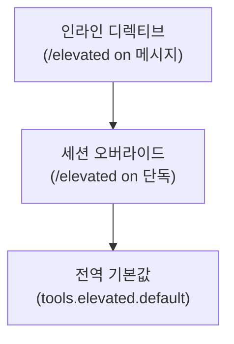

# 상승 권한 (Elevated)

Elevated 모드는 에이전트의 명령어 실행을 샌드박스 대신 **Gateway 호스트에서 직접** 실행하도록 전환합니다.

## 모드

| 디렉티브          | 실행 위치          | 승인     |
| ----------------- | ------------------ | -------- |
| `/elevated off`   | 샌드박스 (기본)    | 정책에 따름 |
| `/elevated on`    | Gateway 호스트     | 승인 유지   |
| `/elevated ask`   | Gateway 호스트     | 승인 유지   |
| `/elevated full`  | Gateway 호스트     | 자동 승인   |

- **`on`/`ask`**: 실행 위치가 Gateway로 전환되지만, 위험한 명령어는 여전히 사용자 승인이 필요합니다.
- **`full`**: 모든 명령어가 승인 없이 자동 실행됩니다. **주의해서 사용하세요.**

## 사용

### 채팅에서 토글

```
/elevated on          # 활성화
/elevated full        # 자동 승인으로 활성화
/elevated off         # 비활성화
```

디렉티브로 메시지와 함께:

```
/elevated on 프로젝트 빌드해줘
```

### 세션 기본값

디렉티브만 보내면 세션 기본값으로 설정:

```
/elevated on          # 이후 모든 메시지에 적용
```

## 설정

### 전역 설정

```json5
{
  tools: {
    elevated: {
      enabled: true,           // 기능 활성화
      default: "off",          // 기본 모드: off | on | ask | full
      allowFrom: ["+821012345678"],  // 허용된 발신자
    },
  },
}
```

### 에이전트별 설정

```json5
{
  agents: {
    list: [
      {
        id: "trusted-agent",
        tools: {
          elevated: {
            enabled: true,
            default: "on",
          },
        },
      },
      {
        id: "restricted-agent",
        tools: {
          elevated: {
            enabled: false,    // 이 에이전트는 상승 불가
          },
        },
      },
    ],
  },
}
```

### Discord 허용 목록 폴백

전역 `allowFrom`이 없으면 Discord는 `channels.discord.dm.allowFrom`을 참조합니다.

## 해석 우선순위



1. **인라인 디렉티브** — 해당 메시지에만 적용
2. **세션 오버라이드** — 세션 내 모든 메시지에 적용
3. **전역 기본값** — 설정 파일의 기본값

## 로깅

상승 모드에서 실행된 명령어는 `info` 레벨로 로깅됩니다. `/status`에서도 현재 세션의 elevated 상태가 표시됩니다.

## 보안 고려사항

- `full` 모드는 **모든 명령어를 승인 없이 실행**합니다
- 신뢰할 수 없는 발신자에게는 elevated를 활성화하지 마세요
- 그룹 채팅에서는 특히 주의하세요
- `allowFrom`으로 허용된 사용자를 제한하세요

## 다음 단계

- [명령어 실행](/ko-KR/tools/exec) - exec 도구 상세
- [실행 승인](/ko-KR/tools/exec-approvals) - 승인 정책
- [샌드박싱](/ko-KR/gateway/sandboxing) - Docker 샌드박스
