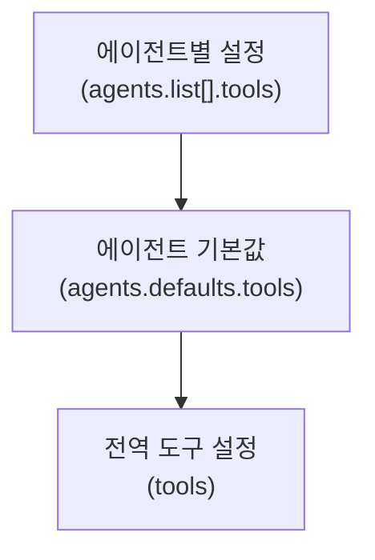

# 에이전트별 샌드박스와 도구 제한

OpenClaw는 세 가지 레이어로 에이전트의 실행 환경과 도구 접근을 제어합니다.

## 세 가지 레이어

| 레이어            | 제어 대상                 | 설정 위치                    |
| ----------------- | ------------------------- | ---------------------------- |
| **샌드박스**      | 실행 환경 (Docker)        | `agents.defaults.sandbox`    |
| **도구 정책**     | 사용 가능한 도구 목록     | `agents.defaults.tools`      |
| **상승 권한**     | 호스트 직접 실행          | `tools.elevated`             |

### 적용 우선순위



에이전트별 설정이 가장 높은 우선순위를 가집니다.

## 샌드박스 모드

```json5
{
  agents: {
    defaults: {
      sandbox: {
        mode: "non-main",          // off | non-main | always
        baseImage: "openclaw/sandbox:latest",
      },
    },
  },
}
```

| 모드       | 설명                                    |
| ---------- | --------------------------------------- |
| `off`      | 모든 세션 호스트 실행                   |
| `non-main` | 메인 세션은 호스트, 나머지는 샌드박스   |
| `always`   | 모든 세션 샌드박스                      |

### 에이전트별 샌드박스

```json5
{
  agents: {
    list: [
      {
        id: "trusted",
        sandbox: { mode: "off" },
      },
      {
        id: "untrusted",
        sandbox: { mode: "always" },
      },
    ],
  },
}
```

## 도구 접근 제한

### 허용/거부 목록

```json5
{
  agents: {
    defaults: {
      tools: {
        allow: ["read", "write", "edit", "bash", "message"],
        deny: ["browser", "canvas"],
      },
    },
  },
}
```

### 에이전트별 도구 프로필

```json5
{
  agents: {
    list: [
      {
        id: "reader",
        tools: {
          allow: ["read", "message"],
          deny: ["*"],               // 나머지 모두 거부
        },
      },
      {
        id: "coder",
        tools: {
          allow: ["*"],              // 모든 도구 허용
          deny: ["canvas"],
        },
      },
    ],
  },
}
```

### 그룹 세션 도구 제한

```json5
{
  agents: {
    defaults: {
      tools: {
        groups: {
          deny: ["bash", "write", "edit"],  // 그룹에서 실행/쓰기 금지
        },
      },
    },
  },
}
```

## exec 보안 모드

```json5
{
  agents: {
    defaults: {
      tools: {
        exec: {
          security: "allowlist",    // deny | allowlist | full
          safeBins: ["ls", "cat", "git", "npm", "node"],
        },
      },
    },
  },
}
```

## 실전 시나리오

### 코딩 에이전트

```json5
{
  id: "coder",
  sandbox: { mode: "off" },
  tools: {
    allow: ["*"],
    exec: { security: "full" },
    elevated: { enabled: true, default: "on" },
  },
}
```

### 채팅 전용 에이전트

```json5
{
  id: "chatbot",
  sandbox: { mode: "always" },
  tools: {
    allow: ["message", "react"],
    deny: ["*"],
  },
}
```

### 읽기 전용 분석 에이전트

```json5
{
  id: "analyzer",
  sandbox: { mode: "non-main" },
  tools: {
    allow: ["read", "browser"],
    exec: { security: "deny" },
  },
}
```

## 다음 단계

- [샌드박싱](/ko-KR/gateway/sandboxing) - Docker 샌드박스 설정
- [명령어 실행](/ko-KR/tools/exec) - exec 도구 상세
- [상승 권한](/ko-KR/tools/elevated) - 상승 모드
